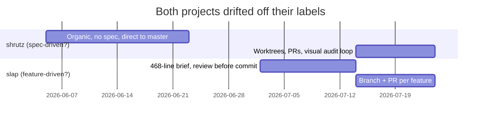
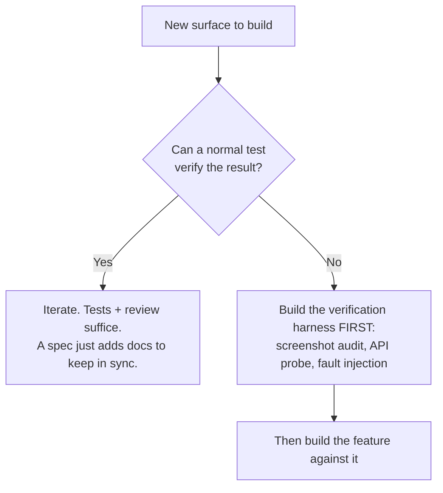
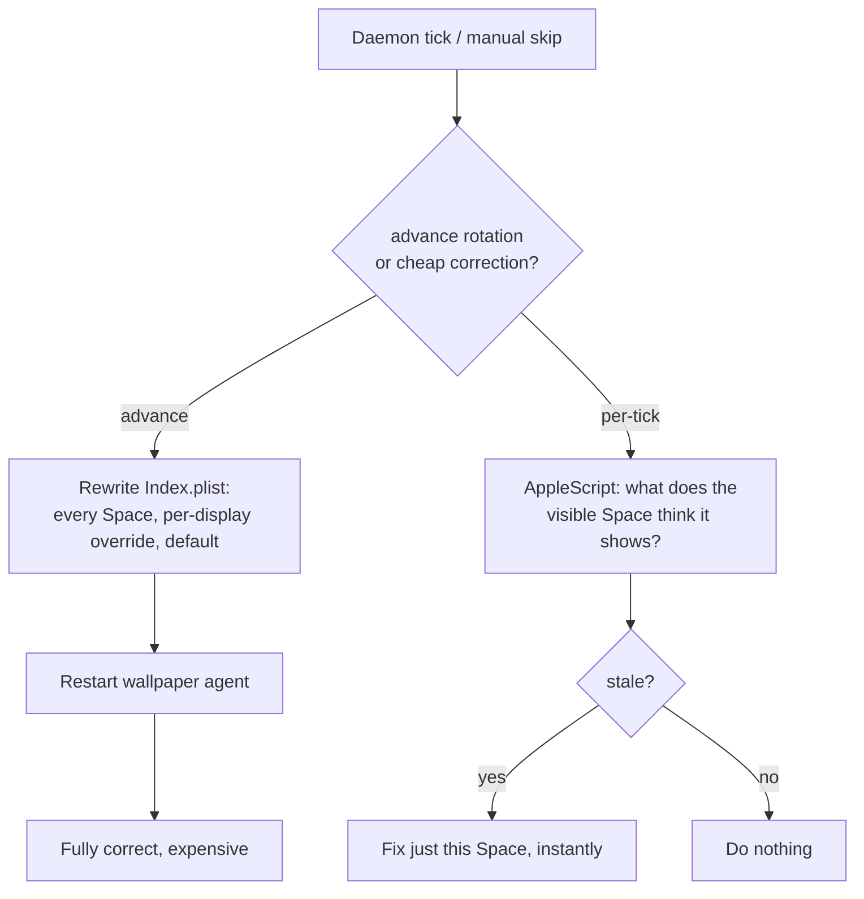

*I built two projects a few weeks apart, one spec-first and one feature-first. The labels inverted, and neither predicted where the work paid off. Verifiability did.*

`shrutz` is a macOS wallpaper rotator that advances on active input time instead of the wall clock: about 2,300 lines of bash daemon plus a Swift menu-bar app. `slap` is a cold-outreach CLI over the GMass API: about 7,165 lines of Python across 19 modules, 796 test functions, a local dashboard. I built the first spec-driven and the second feature-driven. That was the plan.

## The labels inverted

`slap`, the feature-driven one, opened against a 468-line numbered build brief (sections 0 to 14, ending in a literal Build Order) with a read-only review pass gating every commit from hour one. `shrutz`, the spec-driven one, spent two weeks as direct-to-master commits titled things like `FULL POWER`; its only spec-like document was written *after* the engine, weather, gallery, and JSON API had already shipped.



So the label decided little. One question decided a lot: can this result be verified any other way?



Both projects, independently, aimed their heaviest upfront rigor at the surfaces where the answer was *no*.

## Rigor concentrated on the unverifiable surfaces

In `shrutz` that surface was the rendered UI. The repo's only real spec-conformance loop drove the menu-bar app's visual design: approved mockups, a live screenshot captured from the window server, then a written audit diffing pixel dimensions and source constants against the reference. It caught a class of bug tests structurally cannot. Version 2.5 shipped a redesign that still rendered as a flat, dusty taupe. Two compounding color-math bugs: the wallpaper sampler averaged raw RGB per region (which collapses toward grey when saturated and desaturated pixels mix), and five ambient blobs composited with ordinary alpha blending under `.ultraThinMaterial` (which regresses further toward grey on overlap). The fix was saturation-weighted HSB extraction with *circular* hue averaging:

```swift
// simplified: circular mean hue, so reds near 0°/360° don't average to cyan
func meanHue(_ hues: [Double]) -> Double {
    let x = hues.map { cos($0 * .pi / 180) }.reduce(0, +)
    let y = hues.map { sin($0 * .pi / 180) }.reduce(0, +)
    return atan2(y, x) * 180 / .pi   // naive (350 + 10) / 2 = 180° (cyan); this gives ~0° (red)
}
// plus compositing: .compositingGroup().blendMode(.plusLighter) then .saturation(1.3)
```

In `slap` the unverifiable surface was a third party's live behavior. Before any dependent code existed, probe scripts hit the real GMass API and found the docs wrong three ways:

```text
# probes/, run 2026-07-02, pinned in CONTROL_SHEET.md
stop-on-reply : per-stage (stageOneAction..stageEightAction), NOT one global flag
send endpoint : POST /api/campaigns/{campaignDraftId}   # ID in path; body-field form -> HTTP 400
attachments   : JSON {fileName, contentType, base64Content} only  # multipart -> HTTP 415
```

The same sheet records what can *never* be verified: stop-on-reply is write-only, no read-back, so a 200 on send is the strongest signal obtainable. Naming that limit explicitly is the spec doing its actual job.

Everywhere the result *was* testable, both codebases grew by accretion. `slap`'s core files show churn ratios near 1.0 (nearly every line ever written is still present) and zero reverts in the entire history.

## Where it broke: invariants across call sites

GMass rewrites `<a href>` targets for click tracking. A plain-text body has no anchor to rewrite, so `clickTracking: true` is inert. I fixed it once in the draft path by converting to minimal HTML. Three weeks later the identical root cause resurfaced in the follow-up-message path, a different function carrying the same invariant that never got the conversion.

`shrutz` hit the same shape as a naming drift: the installer created the set at `wallpapers/hassan/` but seeded state with `ACTIVE_SET=default`, so the daemon searched a directory that never existed, and `launchd`'s `KeepAlive` turned that into a crash loop on every fresh install. The fix removes the ability to drift by deriving both from one source:

```diff
 WALLS_DEFAULT="$LIB/wallpapers/hassan"
+ACTIVE_SET_DEFAULT="$(basename "$WALLS_DEFAULT")"   # state's ACTIVE_SET can't diverge from the dir we create
 ...
-    printf 'CURRENT_INDEX=0\nACTIVE_SECONDS=0\nACTIVE_SET=default\n'      > "$LIB/state"
+    printf 'CURRENT_INDEX=0\nACTIVE_SECONDS=0\nACTIVE_SET=%s\n' "$ACTIVE_SET_DEFAULT" > "$LIB/state"
```

Diff-scoped review, human or automated, is blind to a rule that must hold across call sites: the defect isn't *in* the diff. The durable fix is structural. One source of truth, or a written invariant with a grep over every site that touches it.

## Where it broke: atomicity

`slap` needed a new value in a SQLite `CHECK` constraint, which means rebuilding the table. The first attempt used `executescript()`, which force-commits any pending transaction before it runs, *including the `BEGIN` the same function just opened*. A crash between the rename and the drop would permanently strand the append-only event log, the app's single source of truth.

```python
def _migrate_events_check_constraint(conn: sqlite3.Connection) -> None:
    row = conn.execute(
        "SELECT sql FROM sqlite_master WHERE type='table' AND name='events'"
    ).fetchone()
    if row is None or "'stopped'" in row[0]:
        return  # fresh db, or already migrated
    conn.execute("BEGIN")
    try:
        conn.execute("ALTER TABLE events RENAME TO events_pre_stopped_migration")
        conn.execute(_EVENTS_TABLE_SQL)          # execute(), NEVER executescript()
        conn.execute("INSERT INTO events (...) SELECT ... FROM events_pre_stopped_migration")
        conn.execute("DROP TABLE events_pre_stopped_migration")
        conn.commit()
    except BaseException:
        conn.rollback()
        raise
```

The regression test (simplified) injects a crash right after the rename and asserts the DB is left in its original, unmigrated state:

```python
class _FlakyConnection(sqlite3.Connection):
    _armed = False
    def execute(self, sql, *a):
        if sql.startswith("ALTER TABLE events RENAME"):
            self._armed = True                       # arm on the rename
        elif self._armed:
            raise sqlite3.OperationalError("injected crash")  # blow up on the next statement
        return super().execute(sql, *a)

def test_migration_rolls_back_cleanly_on_a_mid_migration_failure(tmp_path):
    conn = sqlite3.connect(tmp_path / "e.db", factory=_FlakyConnection)
    # ...seed the old schema, run the migration, expect the raise...
    # assert the live `events` table is intact and still unmigrated
```

That is a correctness *guarantee*, not a happy-path check, and it exists only because the migration was reviewed before it shipped, not after it corrupted something.

## Where it broke: the platform underneath

`shrutz`'s daemon blocked on a foreground `sleep`. Bash defers trap handling until the foreground command returns, so `next`, `pause`, and `resume` could take up to `CHECK_EVERY` seconds (30 by default) to apply. Backgrounding the sleep and `wait`-ing on it lets a signal interrupt immediately:

```bash
# before: SIGUSR1 is queued until sleep returns (up to CHECK_EVERY seconds later)
while :; do tick; sleep "$CHECK_EVERY"; done

# after: wait is interruptible, so the trap fires the instant the signal lands
trap 'apply_now' USR1
while :; do
    tick
    sleep "$CHECK_EVERY" &
    wait "$!"
done
```

And one fix spawned the next: a Redis lock added around dashboard GMass polling left the old direct-poll path live for the case where Redis was *unreachable*, so a Redis outage with concurrent dashboard loads could fire multiple uncoordinated GMass sweeps, discovered three days later. Iteration fixes the failure in front of you and leaves the adjacent one running.

## The verifiable side is only as good as its adversary

On surfaces you *can* test, both projects earned trust by testing adversarially rather than happily. `shrutz`'s gallery installer is proven against a real zip-slip payload:

```python
# guard, shrutz:1938: resolve every member and reject anything escaping the set dir
dest_real = os.path.realpath(dest_dir)
target    = os.path.realpath(os.path.join(dest_real, rel))
if os.path.commonpath([dest_real, target]) != dest_real:
    print(f"error: unsafe path in zip: {member}", file=sys.stderr); sys.exit(1)
```
```bash
@test "gallery install: rejects a zip-slip attempt and writes nothing outside the set dir" {
    run "$SHRUTZ" gallery install evilset          # zip contains ../../../../tmp/pwned.txt
    [ "$status" -ne 0 ] && [ ! -f "/tmp/shrutz-zipslip-pwned.txt" ]
}
```

Some architecture only exists to keep a surface testable at all. `shrutz` splits wallpaper application into a correct-but-expensive path and a fast-but-partial one, and the daemon picks per event:



## What I'm keeping

Spend spec effort only where the result resists a normal test: rendered pixels, a third party's live API, hardware behavior. Build the check *before* the feature. Everywhere else, tests plus review beat more prose.

Don't hand-maintain docs; they go stale fastest exactly when the code moves fastest. `slap`'s context doc still claims a shipped feature isn't built, and the fix for that staleness sits on a branch that was never merged. `shrutz` still carries a CI config that auto-merges to master with no review gate, a fossil of a commit titled "removed PR necessity." Prefer a spec that verifies itself: a screenshot audit, an API probe, a failing test.

Review before the commit, not after. Folding a fix into the commit that introduced the problem is why `slap`'s rework was only 4.3% of lines changed despite being 17.5% of commits.

Treat cross-call-site invariants as first-class: one source of truth, or a documented rule plus a grep over every site. That, more than any methodology name, is what "spec-driven" should have meant all along.
